There is an Objective-C version of this tutorial located [here](https://github.com/MakeGamesWithUs/iOS8-Notes). This code was last tested on Xcode 6.1.1 (6A2008a). There may be errors in other versions of Xcode.

#Setting up a new project

Open Xcode 6.1 (6A1052d) and select *File -> New Project*. Then choose create a *Single View Application*:

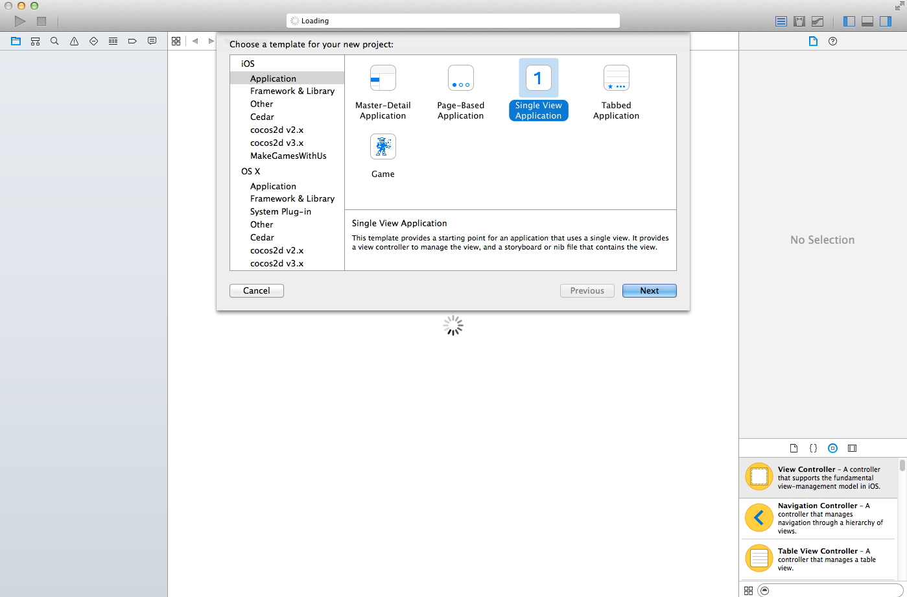

Choose the name for your application and select *Swift* as language:

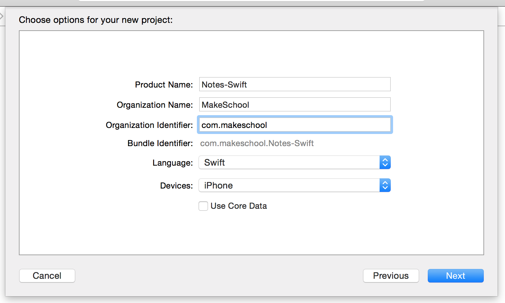

After hitting *next* and choosing a project location Xcode will create the new project, based on a project template. You will see that the template contains, among additional files, an `AppDelegate` class, a `ViewController` class and a `Main.storyboard` file:

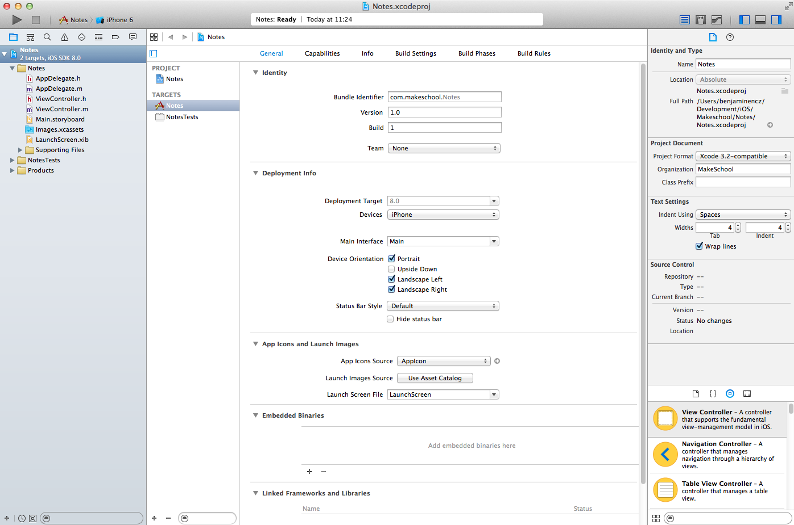

#Configuring the Storyboard

We want to create an app that can display notes. The app will consist of two different view controllers, the first one will display a list of notes, the second one will display the details of a note when it is selected from the list. We will design the entire layout of this app in storyboard. Open the `Main.storyboard` file to get started.

##Setting up the Notes List View Controller

Let's start by creating the first view controller that displays a list of notes. Whenever we want to display items in a list on iOS we use a component called `UITableView`. Since that component is used very often Interface Builder provides a template view controller called *Table View Controller* that provides a basic table view and a ViewController that is associated with it. Before we create it let's remove the default view controller that has been created as part of the template:

- Select the view controller in the Storyboard by clicking into it and hit the delete key
- Remove the `ViewController.swift` class from Xcode (Select "Move to Trash" when prompt appears)

Now your Xcode project should look like this:

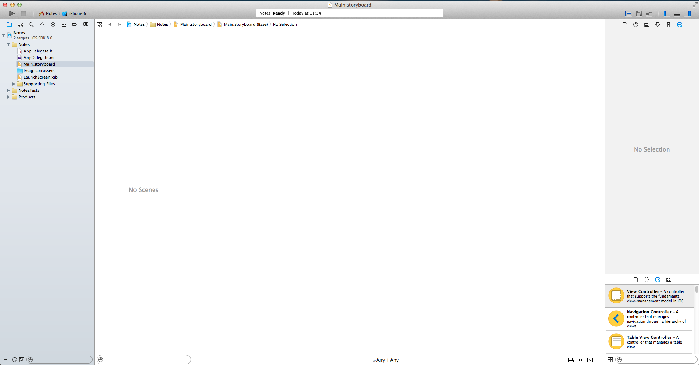

Now select the *Table View Controller* from the Object Library on the bottom right of the Interface Builder UI. You can use the search bar at the bottom to filter the list:

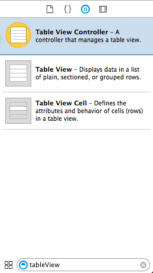

Drag the selected controller to the storyboard stage. Now you have added the first view controller to your app.

iOS needs to know which view controller in our app should be displayed first (this view controller is called the root view controller). In Interface Builder we can configure this by selecting the table view controller and opening the Attributes Inspector in the right panel. Check the box for *is initial View Controller*:

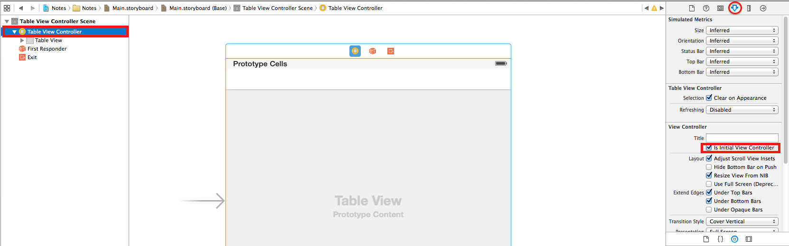

Make sure you have selected the table view controller and not the table view, otherwise you won't be able to find the setting in the inspector. The easiest way to ensure that the controller is selected is using the Document Outline in the left panel. In storyboard based applications the *Info.plist* file has an entry *Main storyboard file base name* that indicates the main storyboard file. The *initial* view controller within the *main* storyboard file is the one that will be displayed as root view controller.

Now that we have configured a root view controller we can run the app for the first time and we should be able to see an empty list:

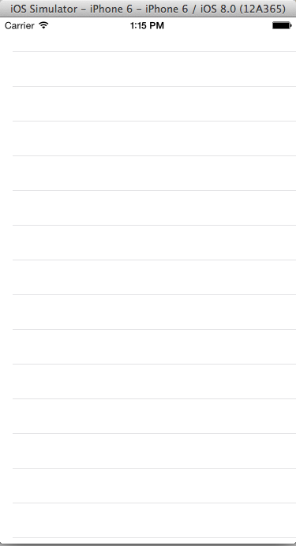

The iPhone 6 and the iPhone 6 Plus Simulators have large screen sizes. If you are working on a Mac with a small screen you might want to downscale the iOS Simulator:

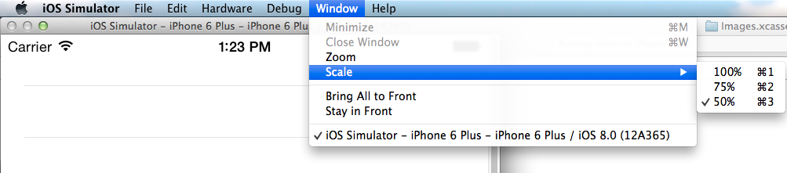

##Adding a Detail View Controller

Now we'll add the view controller that will display the details of a selected Note. For this second view controller we will not use a template but instead start with a blank view controller. Select a *View Controller* from the Object Library in the bottom right and drag it to the storyboard. This blank view controller will become our Detail View Controller. For now we will just configure the high level navigation in our app, that means we won't fill the Detail View Controller with views just now. 

To complete the basic layout of our app we need to add a way to switch between the list and the detail view. Whenever an app has more than one view controller that we want to display, we need to use container view controllers that can handle multiple child view controllers and provide easy mechanics for users to switch between them. For the type of app we are creating now an `UINavigationViewController` is ideal. A `UINavigationViewController` maintains a stack of view Controllers. When we select an entry in the List View Controller we want to push our Detail View Controller for that entry. The navigation controller will create a back button in the top bar that can be used to easily navigate back to the list view. This navigation pattern provided by the `UINavigationViewController` is also incorporated in Apple's Mail and Messages app.

##Adding a Navigation View Controller

Now that we know why we need a navigation view controller, let's add it to our storyboard. Fortunately Interface Builder provides a really easy way to add a navigation view controller to an existing storyboard. Select the table view controller, then select *Editor -> Embed In -> Navigation Controller*.

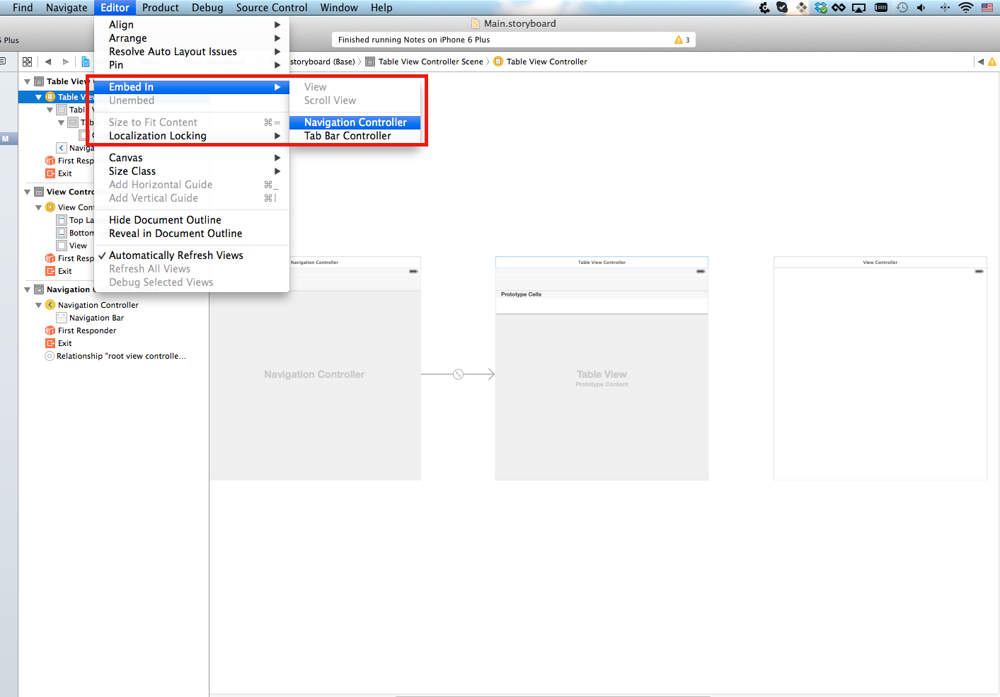

As you can see, Interface Builder creates a navigation controller and embeds the table view controller inside of it. It also automatically turns the navigation controller into the root view controller of the application, as indicated by the arrow pointing towards the navigation controller. With this setup the navigation controller is the root view controller of our application and the table view controller is the root view controller of the navigation view controller. We can run the app again:

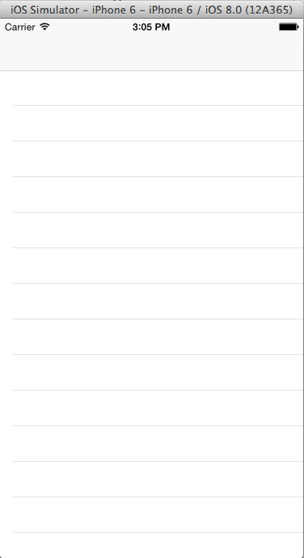

Now you will see a navigation bar above the table view. This indicates that the table view is successfully embedded inside of a navigation controller.

#Add Content to the App

Now that we have the basic navigation set up we should start working on the actual content of our application. We will start with filling the first table view with entries. To create entries we will need to create a new class for our table view controller. This new class needs to be a subclass of `UITableViewController`. Then we will set up our table view controller in storyboard to use our custom class instead the default `UITableViewController` class. 

Create a new class by selecting *File -> New -> File...* 

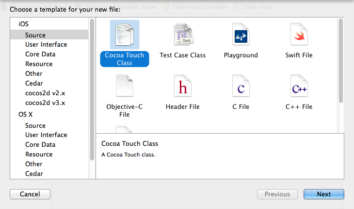

Name the new file `NotesListTableViewController` and make it a subclass of `UITableViewController`.  Make sure the language is set to Swift.

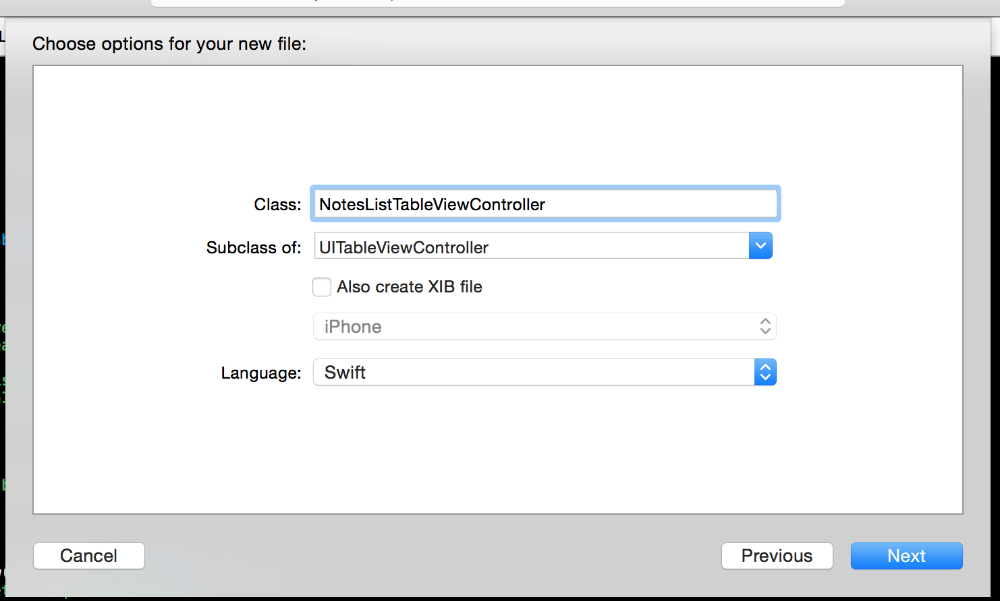

When Xcode creates the `NotesListTableViewController` it uses a template for `UITableViewController` subclasses that comes with a lot of comments and placeholder code.

The `UITableView` is a very important component on the iOS platform, basically every scrollable list of items (e.g. messages, email) is implemented using `UITableView`. `UITableView` declares two protocols `UITableViewDataSource` and `UITableViewDelegate`. 
The data source protocol is used by the table view to determine the content it needs to display, the delegate protocol is used to inform another class about cells that have been selected and to provide an interface for modifying the table view behavior.

The `UITableViewController` creates a `UITableView` and sets itself as the delegate and the data source of the table view. If you were to create a `ViewController` that has a table view and **does not** inherit from `UITableViewController` you would have to set up the data source and the delegate of your table view yourself.

##The UITableViewDataSource protocol

A table view generates its content by asking its data source. The content of a table view is represented by `UITableViewCells`. Each row displays one of these cells. Additionally a `UITableView` can be divided into sections. Sections are represented by small headers between groups of cells. To determine the exact content a table view needs to display it polls its data source by calling the following methods:

	override func tableView(tableView: UITableView, numberOfRowsInSection section: Int) -> Int

	override func tableView(tableView: UITableView, cellForRowAtIndexPath indexPath: NSIndexPath) -> UITableViewCell
	
There are many more methods that are part of the protocol but the two mentioned above are required to be implemented and are sufficient to generate the basic content of the table view. By default a table view has one section. For our Notes app we will go with this default. If we would want to divide our content into multiple sections we would have to implement an additional data source method to report the amount of sections in our table view.

Now lets fill the table view with some placeholder content:

- Remove the `tableView(tableView:, numberOfSectionsInTableView:)` implementation from `NotesListTableViewController.swift`. Because we want to use the default option (one section) we do not need to implement this method
- Change the implementation of `tableView(tableView:, numberOfRowsInSection:)` to return 10, for now we want display 10 placeholder cells in our list:	

		override func tableView(tableView: UITableView, numberOfRowsInSection section: Int) -> Int {
        	// Return the number of rows in the section.
        	return 10
    	}
				
- Add an implementation of `tableView(tableView:, cellForRowAtIndexPath:)`:

	    override func tableView(tableView: UITableView, cellForRowAtIndexPath indexPath: NSIndexPath) -> UITableViewCell {
	        var cell = tableView.dequeueReusableCellWithIdentifier("NotesCell", forIndexPath: indexPath) as UITableViewCell
	        
	        cell.textLabel!.text = "Note"
	        
	        return cell
	    }
		
The `tableView(tableView:, numberOfRowsInSection:)` implementation is quickly explained, the table view wants to know the amount of rows - for now we return 10 as a placeholder, later we will return the amount of notes we have stored in the app.

The second method `tableView(tableView:, cellForRowAtIndexPath:)` is a little bit more complicated. To save memory a `UITableView` only keeps references to cells that are currently visible. Imagine how a list with 20,000 entries would impact memory and performance if the `UITableView` would create every cell upfront and keep a reference to it - dynamically allocating cells as they are needed is a better approach. Additionally the table view is designed to reuse cells that are no longer visible and to use them to display new content that has become visible - once again for performance reasons. This way a table view can use as little as 20 cells to display thousands of entries in a list.

As developers we need to implement the `tableView(tableView:, cellForRowAtIndexPath:)` method in a way that reuses existing table view cells instead of constantly creating new ones. We accomplish this with the first line; we tell the table view to dequeue a cell with a certain *identifier*. The table view will try to reuse an existing cell that is currently not displayed, if that is not possible if will create a new one. We need this identifier because a table view could contain cells of different types (some cells could display places, other music, etc.) and we can only reuse an existing cell if it has the same type as the entry the table view is about to add.

Luckily our app has only one cell type since we only display notes. Our code is now set up to display ten entries in our list. Before we can test this we need to set up some code connections.

##Code Connections

We need two code connections in Interface Builder:

- We need to set the *identifier* of our table view cell in our storyboard to the one that we have used in code
- We need to set the custom class of the table view controller to `NotesListTableViewController`

###Table View Cell Identifier

For this step open *Main.storyboard*. Interface Builder allows us to design different table view cells directly within the table view. These cells are listed under the header "Prototype Cells". Per default a table view has one prototype cell - just enough for our app. Select that prototype cell (you can use the Document Outline left pane, expand Table View Controller, then Table View and click Table View Cell) and set the *identifier* to *NotesCell* in the attributes inspector:

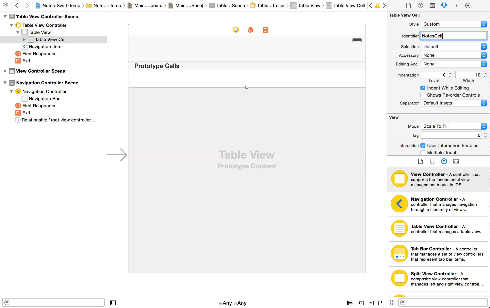

Now that the identifier we have set in code matches the one we have set up in our storyboard, the table view will now which type of cell it needs to instantiate.

##Setting up a Custom Class

For the code in `NotesListTableViewController` to run, we need to set up a reference to it in our storyboard. We do that by setting up a custom class for our table view controller. Select the table view controller, then set the class in the identity inspector:

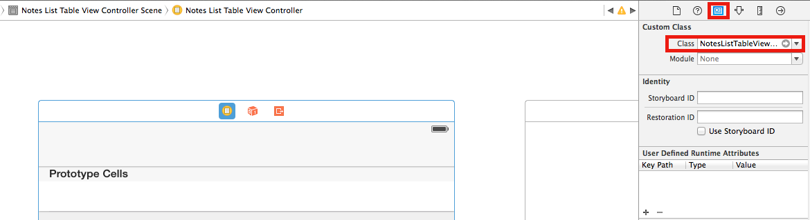

Now our custom class will be instantiated instead of the default `UITableViewController`.

Now it's time to test the app again. Run it and you should see a list with 10 Entries:

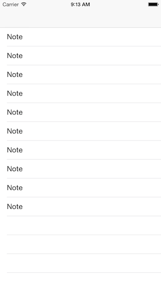

#Connect the Detail View Controller

Next, we want to connect the detail view controller with the list view controller, to complete our app navigation. Storyboard allows us to create these connections visually, they are called *segues*. We want to switch to the Detail View Controller when one of the cells in our list is tapped. Select the table view cell to set up a segue. Then select the rightmost tab in the right panel (Connections Inspector). In the *Triggered Segues* section you can see two different ways how a cell can trigger a transition to a different view controller, upon selection and upon accessory action. We want to transition upon selection, which allows the user to tap anywhere into the cell. We can create the segue by drag gin the mouse from the dot behind the triggered segue to the target view controller:

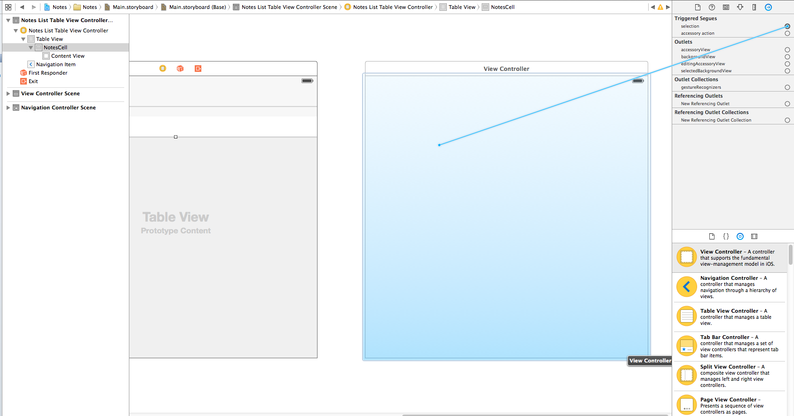

When we drop that connection we get to choose between different presentation types. We want to use *show* which is the default presentation type within a container view controller.

##Set up the Detail View Controller

Our detail view controller will need some content. For this app we'll keep it simple - one textfield for the title of the note and a text view (supports multiple lines of text input) for the body of the note. Add a textfield to the top of the view and the text view below:

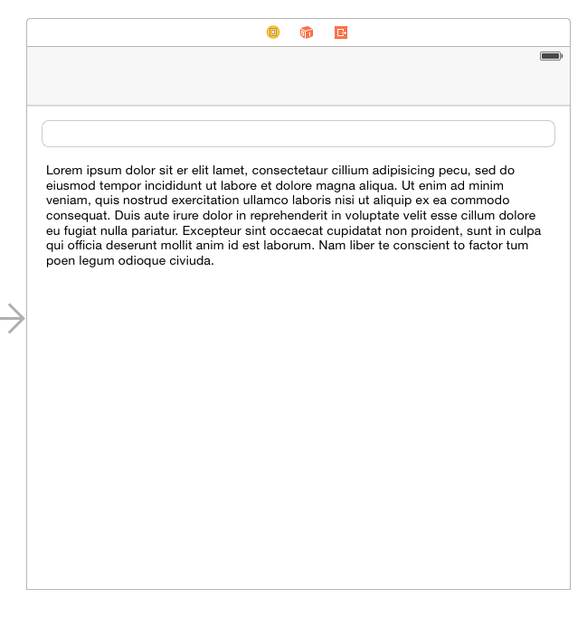

When you run this app you will see that the layout doesn't look that nice. Why? Starting with Xcode 6 we are strongly discouraged from defining User Interfaces with absolute positions, that is why Interface Builder is giving us a preview of our app in square dimensions. However the iPhone 6 is not square and the positions we have set up just don't work on an actual phone. So what is the solution? Auto Layout!
Instead of using absolute positions, Auto Layout lets us define a set of constraints for our views. These constraints allow iOS to calculate absolute positions for different device types. Auto Layout is a whole chapter of its own, so we encourage you to take a look at the [Apple Auto Layout Guide](https://developer.apple.com/library/ios/documentation/UserExperience/Conceptual/AutolayoutPG/Introduction/Introduction.html). For now we will primarily take a look at how we can create layout constraints by creating a simple layout for our detail view.

There are two easy ways to create constraints. First select any view from your storyboard. Then either select the *Pin* button in the right corner of the bottom bar, or hold the *Ctrl* key while dragging to another view. Layout constraints always express a relationship between two different layout elements by *Ctrl*-dragging you can easily choose between which views you want to establish a constraint. The *Pin* button in the bottom bar lets you create multiple constraints at once, but always automatically picks the closest neighbor to establish the constraint with: 

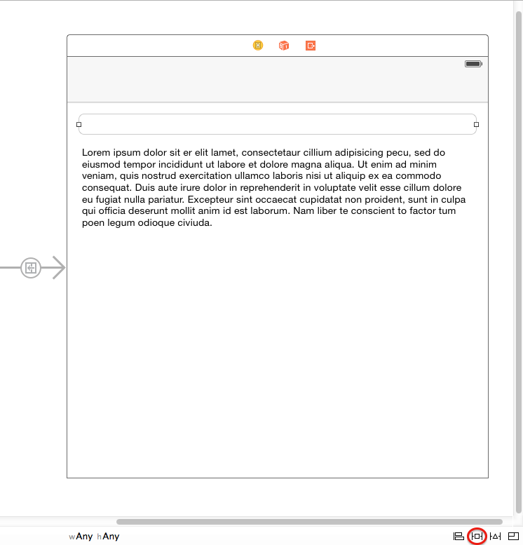

For our purposes the *Pin* button works better, since we only need to set up constraints between neighbors.
Select the textfield and create three constraints. You can see that Interface Builder automatically suggests to create constraints with values based on the current position of the view, so you only need to activate the constraints by clicking onto them:

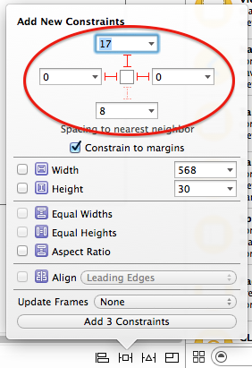

When you've set this up, select *Add 3 Constraints* at the bottom of the view.

These constraints define that we want the text field to have a constant distance to the top of the superview and a constant distance to the left and right margins of the superview. This mean if the parent view resizes this textfield will grow/shrink accordingly.

We want similar settings for our text view. Select the text view and add the following constraints:

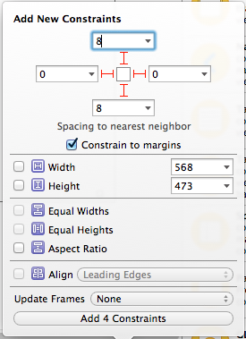

For the text view we need an additional constraint to define the distance between its top border and the bottom border of the text field.

These constraints are sufficient for our app, they allow iOS to calculate the positions of our views based on the screen size. Time to run the app and see that the positioning looks good now. 
You can also test the layout in landscape mode and you will see that it looks good!

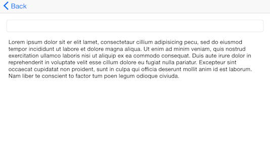

That is the power of Auto Layout.

#Add Notes

Now it's time to add some notes. Currently we are only displaying dummy data, that shall change in this step.

Start off by creating a `Note` class. Go to File -> New -> File -> iOS -> Source -> Swift File

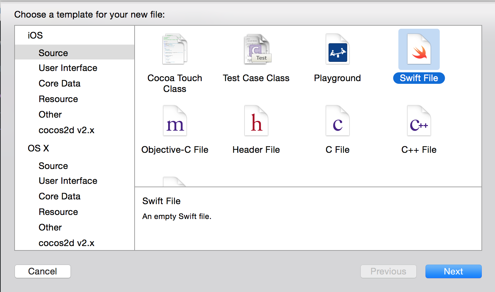

It should have the variables: `title` and `content`.

	class Note {
		var title = ""
	    var content = ""
	}

Once you have done that, let's create some notes in code and display them. Inside of `NotesListTableViewController` add the declaration for an array that will hold our notes:

	var notes: [Note] = []
	
Then implement `initWithCoder`, which is the designated initializer for view controllers that are created from storyboard files, and create notes and add them to the notes array:

	required init(coder aDecoder: NSCoder) {
        super.init(coder: aDecoder)
        
        var note1 = Note()
        note1.title = "Note 1"
        note1.content = "Note 1 content"
        
        var note2 = Note()
        note2.title = "Note 2"
        note2.content = "Note 2 content"
        
        var note3 = Note()
        note3.title = "Note 3"
        note3.content = "Note 3 content"
        
        notes.extend([note1, note2, note3])
    }

Now we have some real notes in our application! We can now change the implementation of our table view data source to use these notes instead of placeholder values. First change the implementation of `tableView(tableView:, numberOfRowsInSection:)`:

	override func tableView(tableView: UITableView, numberOfRowsInSection section: Int) -> Int {
        // Return the number of rows in the section.
        return notes.count
    }
	
Instead of returning a constant value of 10, we are now returning the actual amount of notes in our application.

Now let's change the cell display code:

	override func tableView(tableView: UITableView, cellForRowAtIndexPath indexPath: NSIndexPath) -> UITableViewCell {
        var cell = tableView.dequeueReusableCellWithIdentifier("NotesCell", forIndexPath: indexPath) as UITableViewCell
        
        cell.textLabel!.text = notes[indexPath.row].title
        
        return cell
    }
	
Instead of displaying a placeholder text we are now choosing one of our notes (based on which row the table view wants to display, which is passed in in the indexPath parameter) and display the title of that note.

It's time to run the app again:

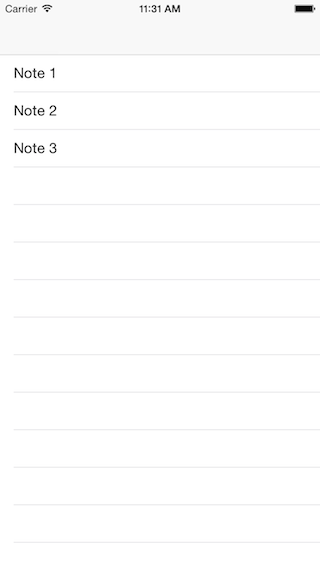

You can now see a list that is generated based on real data stored in our application.

##Passing Notes around

Now that our list can display real `Note` objects we should add that capability to our detail view. This includes to steps:

- Pass a Note that we have selected from the list to the Detail View Controller
- Enable the Detail View Controller to display the Note using the title text field and the content text view

Let's first create a custom class for our Detail View Controller, so that we can add a `note` variable that can be set by the list view controller. Go to File -> New -> File -> iOS -> Source -> Cocoa Touch Class.  


Name the new class `NoteDetailViewController` and make it a subclass of `UIViewController`. Make sure it is a Swift class, not an Objective-C one.  That class shall be able to store a `Note`, this is what it should look like:

	import UIKit

	class NoteDetailViewController: UIViewController {
	
	    var note: Note!
	    
	}
	
Now that we have created this class, we need to set it up as a custom class for the Detail View Controller in our storyboard. Based on the previous example of setting up a custom class you should be able to solve this on your own!
	
Now how can we hand the note to this Detail View Controller? Luckily UIKit provides a convenient method called `prepareForSegue(segue:, sender:)` that is called before a segue occurs. Here developers can access the `destinationViewController`, which is the view controller to which the segue is transitioning. 

We can implement that method in the `NotesListTableViewController` so that we can get access to the `NoteDetailViewController` we are transitioning to.

Add this to *NotesListTableViewController.swift*:

	override func prepareForSegue(segue: UIStoryboardSegue, sender: AnyObject?) {
        var noteDetailViewController = segue.destinationViewController as NoteDetailViewController
        var selectedIndexPath = tableView.indexPathForSelectedRow()
        noteDetailViewController.note = notes[selectedIndexPath!.row]
    } 

In the first line we are accessing the destination view controller of this segue, which is the `NoteDetailViewController`. In the next line we ask the table view which index path is currently selected. That allows us to determine which note has been selected in the list. In the last step we pick that note from our notes array and hand it to the detail view controller.

Now we are successfully handing the note to the Detail View Controller - but we don't get to see much yet. Let's display the note in the detail view controller.

##Displaying a Note in the Detail View Controller

We want to display the title of a note in the text field of the Detail View Controller and the content in the text view. To achieve that we need code connections to be able to change the content of our UI elements in code. Open the main storyboard and select the text field in the note Detail View Controller. Select the connections inspector in the right panel. This is the same tab that you used to trigger the segue from the table view cell to the Detail View Controller. Code connections that allow us to edit UI components from code are called *Referencing Outlets*. To create a code connection you need to switch to the *Assistant Editor* in the top right corner (red circle), that will allow you to display a interface file and code directly next to each other. Then you can drag the dot behind *New Referencing Outlet* into the *NoteDetailViewController.swift* file.

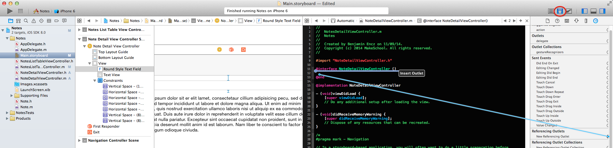

When you end dragging the line a property will be created and you will be prompted for a name. Choose `titleTextField`:

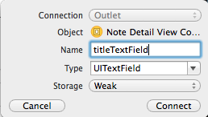

Repeat the same for the text view and name the property `contentTextField`.
Now we have two referencing outlets we can work with. Now we need an adequate place in code where we can display the currently selected note. A good method is `viewWillAppear(animated:):` which is called immediately before the view of a view controller is displayed. Add this implementation to *NoteDetailViewController.swift*:

	override func viewWillAppear(animated: Bool) {
        super.viewWillAppear(animated)
        
        titleTextField.text = note.title
        contentTextField.text = note.content
    }

Now you can test the app and you will see that selected notes are passed to the Detail View Controller and displayed there.

You will maybe realize that changes to the notes that you make in the detail view aren't saved. When you switch back to the List View Controller all changes to notes disappear. Luckily that is easily fixed.

##Storing changes to a note

For the purpose of our small app storing changes to notes can be implemented very simple. Whenever the Detail View Controller disappears (which happens when a user hits the back button) we update the note with the current content displayed in our views. Can you guess how the method we are about to implement is called? Right - `viewWillDisappear(animated:)`:

	override func viewWillDisappear(animated: Bool) {
        super.viewWillDisappear(animated)
        
        note.title = titleTextField.text
        note.content = contentTextField.text
    }

Now you will see that changes are persisted correctly. When switching back and forth between our two view controllers all changes we make in the Detail View Controller get displayed correctly. However, the list of notes always shows the old titles of our notes.

##Reloading a Table View

The `UITableView` does not automatically refresh its content. In order to refresh the list we need to call `reloadData` on the table view (the `UITableViewController` calls `reloadData` once automatically when the table view is empty, that's why we only need to call it to refresh the table view content, not for the initial load).

Once again a good place to trigger view updates is in the `viewWillAppear(animated:)` method. Add this method to *NotesListTableViewController.swift*:

	override func viewWillAppear(animated: Bool) {
        super.viewWillAppear(animated)
        
        tableView.reloadData()
    }

Now we ask the table view to refresh its content every time it is displayed. This will trigger the table view to call the `tableView(tableView:, numberOfRowsInSection:)` and `tableView(tableView:, cellForRowAtIndexPath:)` methods on its data source, which is `NotesListTableViewController`. Here we will create cells that reflect the updated notes.

Time to run the app once again. You should see notes updating and persisting in both view controllers correctly now.

#Adding User Created Notes

One of the main changes we need to make to complete this app is letting the user to create and delete notes. At the moment we are creating three notes in code and the user can only edit these.

First we need to add a button that allows the user to create a new note. Let's add a *+* button to the List View Controller. A common place to place buttons within view controllers that are wrapped into a navigation controller is in the navigation bar at the top of the screen. This is also where the back button is placed automatically.

Buttons for that top bar are called bar button items. Luckily UIKit already provides a *+* button style for us. Add a bar button item to the navigation bar and change the style to be a *+* button:
 


iOS apps stand out because of great usability. For our app it would be nice if the *+* button would create a new note and then display the same view controller that is used to display/edit notes. This way the user will only have to be familiar with two different view controllers.

Let's add a segue from the *+* button to the detail view controller:

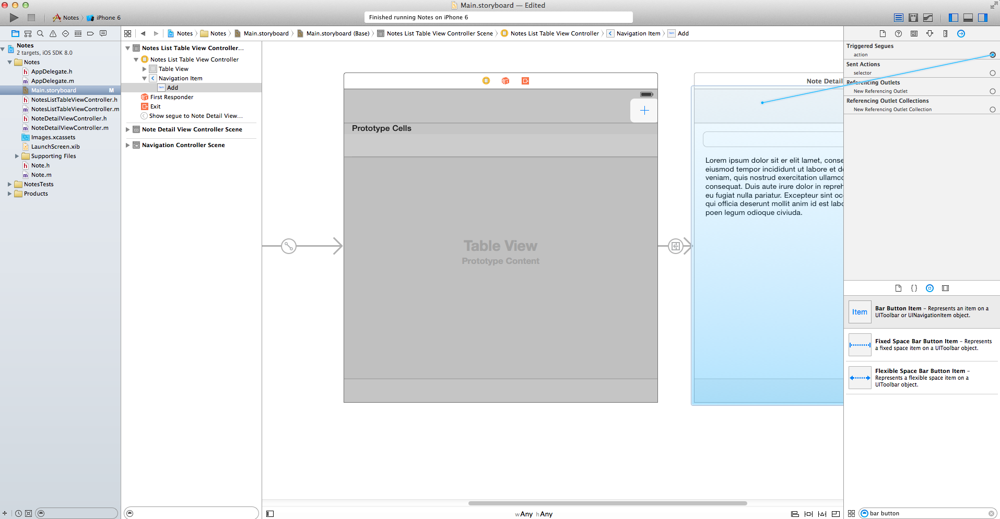

Choose this to be a *show* segue again. If you happen to test the *+* button now you will realize that a transition happens, but instead of creating a new note we are always displaying the first note in the list. Where could we implement creating a new note before we transition to the detail view controller? Right - in the `prepareForSegue(segue:, sender:)` method inside of `NotesListTableViewController`.

Thinking about this you might realize that we now have two different segues that both transition from the list view controller to the detail view controller. In order to determine if we need to select an existing note for display or if we need to create a new note we need to know which of these two segues is currently going on. UIKit allows us to assign *identifiers* to segues, that allows us to implement different behavior for different segues.  Let's assign two different identifiers to our segues. We can do so by selecting a segue in our storyboard and selecting the attributes inspector:

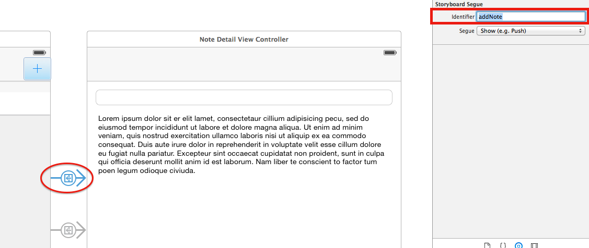

Choose "addNote" as the identifier for the segue from the *+* button and "showNote" for the segue from the table view cell.
Now we can identify the two different segues. Let's change the implementation of our `prepareForSegue(segue:, sender:)` method accordingly:

	override func prepareForSegue(segue: UIStoryboardSegue, sender: AnyObject?) {
        if segue.identifier! == "showNote" {
            var noteDetailViewController = segue.destinationViewController as NoteDetailViewController
            var selectedIndexPath = tableView.indexPathForSelectedRow()
            noteDetailViewController.note = notes[selectedIndexPath!.row]
        } else if segue.identifier! == "addNote" {
            var note = Note()
            notes.append(note)
            var noteDetailViewController = segue.destinationViewController as NoteDetailViewController
            noteDetailViewController.note = note
        }
    }

On a *Show Note* segue we are performing our old code, on a *Add Note* segue we are creating a new note, adding it to our array of notes and handing that new note to the detail view controller. Now a user is able to add custom notes to this app. If you feel like improving the app you could set up a default title and content for newly created notes.

Now that a user can create notes we no longer need to create dummy ones. You can remove the whole ```initWithCoder``` method.
	
#Deleting Notes

The ability to delete notes is nearly as important as the one to add them. This will also be the last feature that we are adding to this app. Implementing a deletion mechanism is simple. The default delete gesture on iOS is swiping to the left on a table view cell. This can be implemented in our own apps by adding the `tableView(tableView:, commitEditingStyle:, forRowAtIndexPath:)` method that is part of the `UITableViewDataSource` protocol.

The method gets called when the user attempts to delete an entry with the before mentioned gesture. It is the developers task to delete the according element from the data model and also trigger a visual deletion of the table view cell. Here is the two-liner implementation that does the deletion magic:

	override func tableView(tableView: UITableView, commitEditingStyle editingStyle: UITableViewCellEditingStyle, forRowAtIndexPath indexPath: NSIndexPath) {
        notes.removeAtIndex(indexPath.row)
        tableView.deleteRowsAtIndexPaths([indexPath], withRowAnimation: UITableViewRowAnimation.Automatic)
    }
	
The first line simply deletes the note from our notes array, now our data model is up to date. The second line updates the UI to reflect the deletion. The table view provides a convenience method to do that: `deleteRowsAtIndexPaths(indexPaths:, withRowAnimation:)`.
Now you should be able to add, edit and delete notes! Well done.
